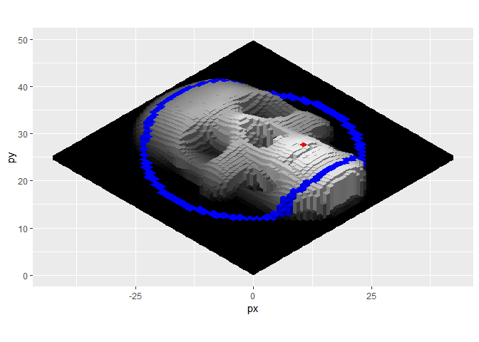

<!-- README.md is generated from README.Rmd. Please edit that file -->

# isocuboids 

<!-- badges: start -->

[](https://lifecycle.r-lib.org/articles/stages.html#experimental)
<!-- badges: end -->

An **experimental** and **in development** R package for the production
of isometric pseudo 3-D images.

Pseudo, because (for images) the height of the cuboids can be mapped to
different aspects of the pixel colour (or position), creating a ‘fake
3D’ effect which may have no correlation to any form of ‘real’ height.
Shading of the cuboid faces is also done naively - it’s a simple
reduction in brightness, so there is no clever physics going on here!

I am developing this project for fun and personal learning. If it’s
useful to you in any way, that’s great news, but please bear the
following in mind…

-   There are some incredibly cool R packages for doing this type of
    thing properly…
    -   [rayshader](https://github.com/tylermorganwall/rayshader)
    -   [ggrgl](https://github.com/coolbutuseless/ggrgl)
    -   [isocubes](https://github.com/coolbutuseless/isocubes)
-   All of my knowledge on isometric projections has come from
    [this](https://en.wikipedia.org/wiki/Isometric_projection) wikipedia
    article
-   This package is written purely in R (there is no C++ code) so it is
    slow to run for large numbers of cuboids
-   I don’t know what I’m doing!

### Overview

-   For **images/pictures**
    -   use `cuboid_image()`
    -   Each pixel is turned into a cuboid that has its height (from the
        zero ground plane) modified in proportion to some (chosen)
        aspect of the pixel colour.
-   For **matrices**
    -   `cuboid_matrix()`
    -   The height of the cuboid is mapped to the value of the
        individual matrix elements.

# Images

``` r
library(tidyverse)
library(magick)
library(isocuboids)
```

Read an image

``` r
i <- 'https://tatianamowry.files.wordpress.com/2018/06/skull-dm.png'
image_read(i)
```


## Defaults

By default, images are resized to be 60 cuboids wide `res = 60` and
rendered at isometric projection angles. Cuboid heights are mapped to
the brightness value of their corresponding pixel and scaled to range
between 1 and 10 units high

``` r
cuboid_image(i)
```


## Orientation perspective

The orientation applied to the image before projection. This changes the
perspective of the final output. Note that this is a transformation of
the incoming image - the origin of the coordinate system is unchanged.

``` r
cuboid_image(i, orientation = 1)
cuboid_image(i, orientation = 2)
cuboid_image(i, orientation = 3)
cuboid_image(i, orientation = 4)
```


## Fill colour and shading

The fill colour and degree of side shading can be modified with the
`cuboid_fill` and `shading` values

``` r
cuboid_image(i, cuboid_fill = hcl.colors(20, "viridis"))
cuboid_image(i, cuboid_fill = "antiquewhite")
cuboid_image(i, cuboid_fill = hcl.colors(20, "plasma"), shading = c(0, 0, 0.7))
cuboid_image(i, cuboid_fill = hcl.colors(20, "plasma"), shading = c(0, 0.7, 0))
```


## Height scale

The overall scaling of the cuboid height can be set with `height_scale`

``` r
cuboid_image(i, height_scale = c(0, 0))
cuboid_image(i, height_scale = c(0, 10))
cuboid_image(i, height_scale = c(30, 40))
cuboid_image(i, height_scale = c(40, 30), cuboid_fill = hcl.colors(20, "plasma"))
```


## Return data

For fine control, a dataframe of the projected coordinates and polygon
groups/colours can be returned

``` r
df <- cuboid_image(i, return_data = TRUE, height_scale = c(1, 10))
head(df)
#> # A tibble: 6 × 21
#>       x     z col           r     g     b     h     s     v cuboid…¹     y face 
#>   <dbl> <dbl> <chr>     <int> <int> <int> <dbl> <dbl> <dbl>    <int> <dbl> <chr>
#> 1    59    59 #000000ff     0     0     0     0     0     0     3600     1 right
#> 2    59    59 #000000ff     0     0     0     0     0     0     3600     1 right
#> 3    59    59 #000000ff     0     0     0     0     0     0     3600     1 right
#> 4    59    59 #000000ff     0     0     0     0     0     0     3600     1 right
#> 5    59    59 #000000ff     0     0     0     0     0     0     3600     1 left 
#> 6    59    59 #000000ff     0     0     0     0     0     0     3600     1 left 
#> # … with 9 more variables: ux <dbl>, uy <dbl>, uz <dbl>, px <dbl>, py <dbl>,
#> #   pz <dbl>, v_adjusted <dbl>, col_adjusted <chr>, plot_group <fct>, and
#> #   abbreviated variable name ¹​cuboid_id
#> # ℹ Use `colnames()` to see all variable names
```

Filter rows and columns

``` r
# Slices in z
df |> 
    filter(z %in% c(40, 20)) |> 
    ggplot()+ 
    geom_polygon(aes(x = px, y = py, fill = I(col_adjusted), group = plot_group), col = NA)+
    coord_equal()

# A ring of coordinates
df |> 
    mutate(
        xn = x - max(x)/2,
        zn = z - max(z)/2,
        r = sqrt(xn^2 + zn^2)) |> 
    filter(between(r, 22, 24)) |> 
    ggplot()+ 
    geom_polygon(aes(x = px, y = py, fill = I(col_adjusted), group = plot_group), col = NA)+
    coord_equal()
```


Highlight specific cuboid faces

``` r
df |> 
    mutate(
        xn = x - max(x)/2,
        zn = z - max(z)/2,
        r = sqrt(xn^2 + zn^2),
        col_adjusted = 
            case_when(
                y == max(y) & face == "top" ~ "red",
                y == max(y) & face == "left" ~ "red3",
                y == max(y) & face == "right" ~ "red4",
                between(r, 22, 24) & face == "top" ~ "blue",
                between(r, 22, 24) & face == "left" ~ "blue3",
                between(r, 22, 24) & face == "right" ~ "blue4",
                TRUE ~col_adjusted)) |> 
    ggplot() + 
    geom_polygon(
        aes(x = px, y = py, fill = I(col_adjusted), group = plot_group), 
        col = NA) +
    coord_equal()
```



Split the plot through facetting

``` r
df |> 
    ggplot() + 
    geom_polygon(
        aes(x = px, y = py, fill = I(col_adjusted), group = plot_group), 
        col = NA) +
    coord_fixed()+
    facet_wrap(~z > 30, ncol=1)

df |> 
    ggplot() + 
    geom_polygon(
        aes(x = px, y = py, fill = I(col_adjusted), group = plot_group), 
        col = NA) +
    coord_fixed()+
    facet_wrap(~ x < 30 & y > 5, ncol = 1)
```


## Height mapping

Cuboid height is mapped from the image pixel values. By default,
brightness `v` is used. Any function of the following parameters can be
passed to `height_map` - red `r` - green `g` - blue `b` - hue `h` -
saturation `s` - brightness `v` - x-position `x` - z-position `z`

``` r
i2 <- 
    image_read('https://www.r-project.org/logo/Rlogo.png') |> 
    image_background("white")

i2
```


Various functions of the x and z coordinates

``` r
cuboid_image(i2, 
             height_map = sin(scales::rescale(x,c(0,4*pi))), 
             crop_square = FALSE,
             height_scale = c(1, 10)
)

cuboid_image(i2, 
             height_map = z^3,
             crop_square = FALSE,
             height_scale = c(1, 30), a1 = 80)

cuboid_image(i2, 
             height_map = ((x - (max(x)/2))^2) + ((z - (max(z)/2))^2),
             crop_square = FALSE, 
             height_scale = c(1, 30))

cuboid_image(i2, 
             crop_square = FALSE, 
             height_map = (x-(max(x)/2))^3, 
             height_scale = c(1, 50))
```


Demonstration of mapping various different colour values to height.

``` r
# Create a 'rainbow' colour image
i3 <- 
    rep(viridis::turbo(100), each = 40) |> 
    matrix(ncol = 100) |> 
    image_read()

i3
```


Map hue, red, green and blue to height

``` r
cuboid_image(i3, res = NULL, height_map = h, crop_square = FALSE)
cuboid_image(i3, res = NULL, height_map = r, crop_square = FALSE)
cuboid_image(i3, res = NULL, height_map = g, crop_square = FALSE)
cuboid_image(i3, res = NULL, height_map = b, crop_square = FALSE)
```


## Pre-edit with {magick}

Edit the image before passing into `cuboid_image()`

``` r
image_read(i) |> 
    image_resize("60x60") |> 
    image_motion_blur(angle = 45, radius = 6, sigma = 20) |> 
    cuboid_image(res = NULL)

image_read(i) |> 
    image_resize("60x60") |>
    image_canny() |> 
    cuboid_image(res = NULL, orientation = 2)
```


# Matrices

For matrices, the matrix is not resized and the height of the cuboids is
mapped directly to the values contained in the matrix.

``` r
cuboid_matrix(matrix(1))
cuboid_matrix(matrix(1:5), show_height_plane = TRUE)
cuboid_matrix(matrix(1:5), show_height_plane = TRUE, orientation = 4)
cuboid_matrix(matrix(seq(0,2,l=25), nrow=5), show_height_plane = TRUE, cuboid_col = 1)
```


Some examples with the `volcano` data

``` r
cuboid_matrix(volcano |> scales::rescale(c(0,20)))
cuboid_matrix(volcano |> scales::rescale(c(20,0)))
```


